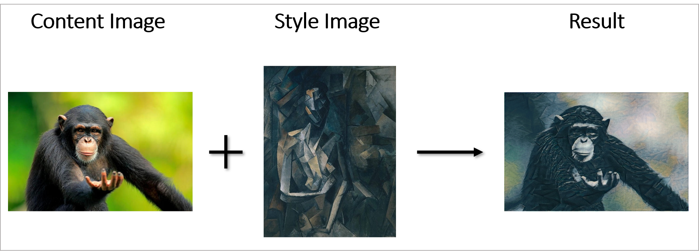

# Implementing the Neural Style Transfer algorithm :art: [[1]](#1)

  

    <em>Figure 1: The method.</em>

  

    <em>Figure 2: Neural Style Transfer with 1000 iterations.</em>

## References :books:
<a id="1">[1]</a> 
Gatys et al. (2015). 
_A Neural Algorithm of Artistic Style_
[Link](https://arxiv.org/abs/1508.06576)
